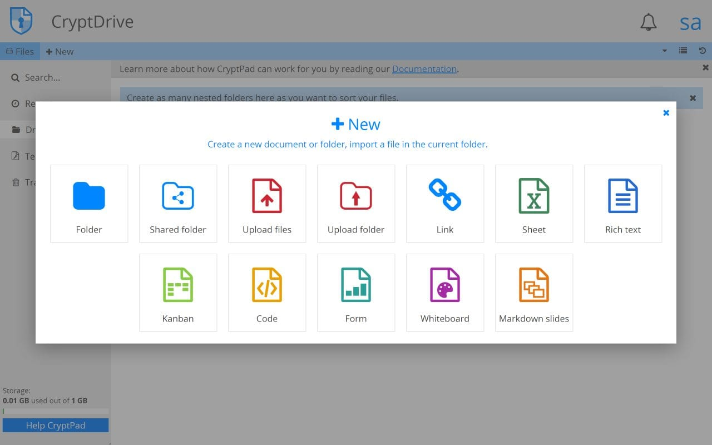

# Cryptpad docker compose demo CI/CD pipeline

Example CI/CD pipeline showing how to deploy a direct instance to elestio.

 
 

# Once deployed ...

You can connect to the Cryptpad Dashboard:

    Access URL: https://[CI_CD_DOMAIN]/
